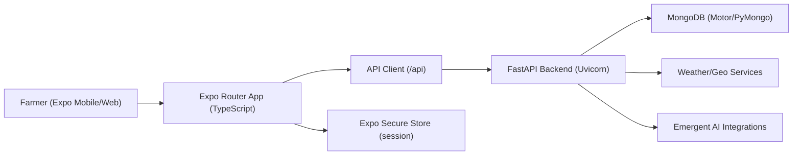

<div align="center">

# 🌾 Krushi Raksha

### A mobile-first farming companion for Maharashtra — weather, crop intelligence, bilingual guidance, and local agri-marketplace support in one experience.


<p>
  
  
  
  
</p>

</div>

---

## Why Krushi Raksha?

Farmers often juggle weather uncertainty, crop health decisions, record-keeping, and finding trusted local support.  
**Krushi Raksha** is designed as a practical, bilingual (English + Marathi) companion that brings these workflows into a single mobile-first surface for local agricultural communities in Maharashtra.

## What it solves

| Problem in the field | Krushi Raksha approach |
|---|---|
| Weather and risk context is fragmented | Dashboard combines location-aware weather + risk cues |
| Crop troubleshooting is delayed | AI crop-photo diagnosis provides guided next steps (not definitive diagnosis) |
| Knowledge access is language-limited | Assistant supports Marathi and English conversations |
| Farm records are hard to track consistently | Private diary for crop activities and expense entries |
| Finding equipment/work opportunities is slow | Local marketplace for rentals, farmer hiring, and worker availability |
| 7/12 workflows are confusing | Guided steps and official portal handoff support |

## Feature matrix

| Capability | Available | Notes |
|---|:---:|---|
| Weather + dashboard intelligence | ✅ | Location-based weather and risk cues |
| AI crop-photo diagnosis | ✅ | Upload JPEG/PNG/WEBP, receive practical guidance |
| Bilingual assistant (EN/MR) | ✅ | Context-aware farming Q&A |
| Private crop diary & expenses | ✅ | Per-user entries with create/read/delete flows |
| Local marketplace | ✅ | Equipment rental, farmer hiring, worker availability + request/accept/decline |
| Precise GPS + manual search | ✅ | Foreground location with manual fallback |
| Authentication & privacy | ✅ | Google sign-in/session flow, per-user scoped records |
| 7/12 guidance | ✅ | Official portal guidance + local steps |

## Architecture (high-level)



## Repository structure

```text
/home/runner/work/Krishi-Raksha/Krishi-Raksha
├── README.md
├── backend
│   ├── server.py
│   ├── auth.py
│   ├── database.py
│   ├── locations.py
│   ├── marketplace.py
│   ├── requirements.txt
│   └── tests
│       ├── test_auth_market_private_flows.py
│       └── test_krushi_raksha_api.py
├── frontend
│   ├── app
│   │   ├── _layout.tsx
│   │   └── index.tsx
│   ├── src
│   │   ├── api.ts
│   │   ├── auth.tsx
│   │   ├── location.tsx
│   │   ├── query-client.ts
│   │   └── screens
│   │       ├── Assistant.tsx
│   │       ├── Diary.tsx
│   │       ├── FarmSheets.tsx
│   │       ├── Home.tsx
│   │       ├── Market.tsx
│   │       ├── MarketForms.tsx
│   │       └── Welcome.tsx
│   └── package.json
├── memory
│   └── PRD.md
└── tests
```

## Tech stack

### Frontend

| Layer | Technology |
|---|---|
| App runtime | Expo SDK 57, React Native 0.86 |
| Navigation | Expo Router |
| Language | TypeScript |
| Data fetching/state | TanStack Query |
| Device services | Expo Location, Expo Image Picker, Expo Secure Store |
| UI/interaction | React Native Reanimated, Expo Linear Gradient, WebView |

### Backend

| Layer | Technology |
|---|---|
| API framework | FastAPI + Uvicorn |
| Data layer | MongoDB (Motor / PyMongo) |
| Models/validation | Pydantic |
| Auth/session | JWT/session patterns, bcrypt/passlib flows |
| AI + integrations | Emergent integrations (chat/image), requests, pandas, numpy |

## Design principles

- **Mobile-first practicality:** optimized for quick, in-field usage.
- **Bilingual accessibility:** English and Marathi experiences.
- **Privacy by default:** data scoped to authenticated users.
- **Actionable guidance over noise:** concise recommendations and risk cues.
- **Human-in-the-loop decisions:** AI assists farmers; it does not replace local agronomy expertise.

## Local setup

### 1) Backend (FastAPI)

```bash
cd /home/runner/work/Krishi-Raksha/Krishi-Raksha/backend
python -m venv .venv
source .venv/bin/activate  # Windows: .venv\Scripts\activate
pip install -r requirements.txt
```

Create `/home/runner/work/Krishi-Raksha/Krishi-Raksha/backend/.env` with MongoDB configuration (at minimum `MONGO_URL` and `DB_NAME`), then run:

```bash
uvicorn server:app --host 0.0.0.0 --port 8001
```

### 2) Frontend (Expo)

```bash
cd /home/runner/work/Krishi-Raksha/Krishi-Raksha/frontend
yarn install
# or: npm install
```

Set backend URL for the app:

- `EXPO_PUBLIC_BACKEND_URL` environment variable, **or**
- `expo.extra.backendUrl` in Expo config

Then start:

```bash
npx expo start
```

## Testing and linting

Backend:

```bash
cd /home/runner/work/Krishi-Raksha/Krishi-Raksha/backend
pytest
```

Frontend lint:

```bash
cd /home/runner/work/Krishi-Raksha/Krishi-Raksha/frontend
npm run lint
```

## API & domain overview

| Domain | Example API paths |
|---|---|
| Health / dashboard | `/api/`, `/api/dashboard` |
| Authentication | `/api/auth/session`, `/api/auth/me`, `/api/auth/logout` |
| Crops & diary | `/api/crops`, `/api/diary` |
| AI services | `/api/diagnosis`, `/api/assistant`, `/api/assistant/history` |
| Location & marketplace | `/api/location`, `/api/locations/search`, `/api/market/listings` |
| 7/12 guidance | `/api/land-records`, `/api/land-records/log-download` |

## Security & privacy notes

- Session and user flows are designed around authenticated access and per-user data scope.
- Backend reads protected configuration from environment (`.env` in backend context).
- Treat AI outputs as advisory support, not guaranteed diagnosis or legal/certified records.
- For sensitive farm/account environments, review deployment hardening before production use.

## Roadmap (prospective)

> The following are ideas, not guaranteed current functionality.

- Better offline-first sync for low-connectivity field conditions
- Notifications for marketplace requests and risk events
- Enhanced crop trend analytics and seasonal insights
- Deeper integrations with trusted local agri advisory services

## Contributing

Contributions are welcome. Please open an issue with context, proposed changes, and test notes before large refactors.

## License

No license file is currently declared in this repository.
